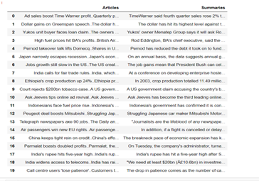
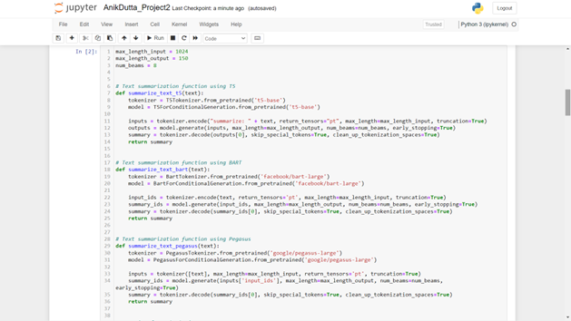
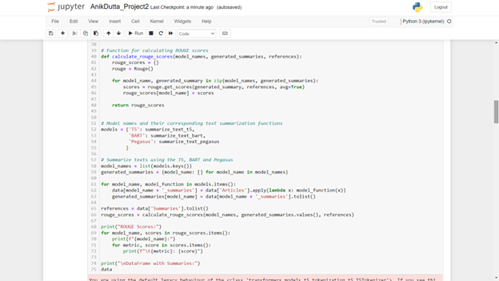
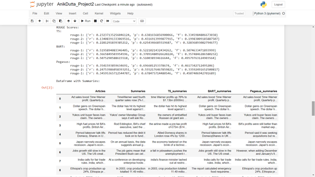
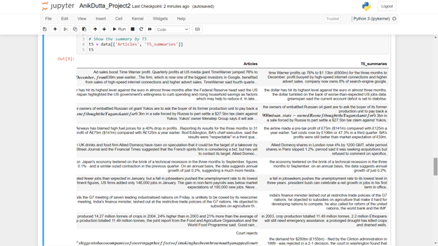
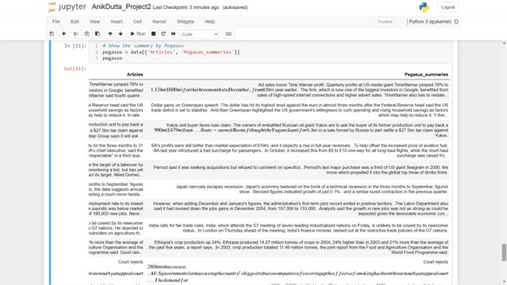

# Text Summarizer

An AI-based text summarizer using various transformer-based models like T5, BART, and PEGASUS on the BBC News Summary dataset.

I have considered the top 20 rows of the dataframe for less computation and processing time. Here's how the data looks like,

    

After that, I defined the text summary function for T5 (t5-base), BART (facebook/bart-large), and PEGASUS (google/pegasus-large) transformers. All of them had a maximum token length for the input of 1024, a maximum token length for the output of 150, and a maximum number of beams/tokens of 8. All these parameters yielded better performance from these models with higher computational time and resources.

    

After defining the text summarization functions, I defined the function that calculates the ROUGE (Recall-Oriented Understudy for Gisting Evaluation) scores for all the models. Later, I used this function to get the ROUGE scores for the models.

    
    

BART had the best Recalls and F1 scores. In comparison, PEGASUS had the best precisions. Based on the priorities, we can decide between BART and PEGASUS as the best technique for text summarization.
Here are the summaries generated by using these models with the original articles.

    
    
    

## Dataset

The dataset used for this project is the BBC News Summary dataset [here](https://www.kaggle.com/datasets/pariza/bbc-news-summary), which consists of 2225 article and summary text files in .txt format. The dataset has been preprocessed and converted into a CSV file named `bbc_news.csv`.

## Dependencies
* python 3
* Libraries:
    * pandas
    * transformers
    * rouge

## Usage
Run the python script "text_summarizer.py"

## Acknowledgments

- This project is based on the Text-to-Text Transfer Transformer (T5) model by Google, Bidirectional Auto-Regressive Transformers (BART) model by Facebook, and PEGASUS model by Google.
- Special thanks to the authors of the BBC News Summary dataset.
